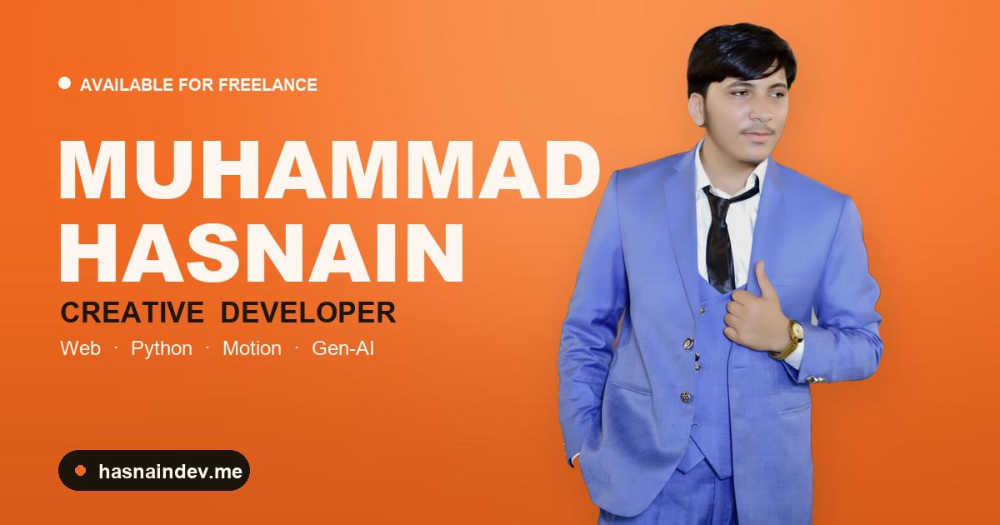

<div align="center">

<a href="https://hasnaindev.me">
  
</a>

# Muhammad Hasnain — Portfolio

**My personal portfolio — an elegant orange &amp; white site built to feel crafted, not templated.**
Live at **[hasnaindev.me](https://hasnaindev.me)**.

<br>

[](https://hasnaindev.me)


</div>

---

## ✨ Highlights

- **A cutout hero that stands in the scene** — a background-removed portrait planted over a giant name, with a warm spotlight, a grounding shadow and a subtle magnetic hover.
- **Display type that never clips** — headlines render as SVG that auto-fits to the container width, so the wordmark always fills the space edge-to-edge and can't get cut off.
- **Character-by-character About reveal** — the bio inks in one letter at a time as you scroll.
- **Expertise cards in real 3D** — each card tilts toward the cursor (`perspective` + `rotateX/Y`) with an orange glow that follows the pointer.
- **All 8 projects with working demos** — a clean grid, each with a **Live Demo** and **View Code** button.
- **Animated FAQ accordion** and a **working contact form** (Web3Forms — no backend, replies land straight in the inbox).
- **Elegant, un-templated look** — warm orange / cream palette, the **Kanit** typeface, a fine grain and tasteful motion throughout.
- **Responsive &amp; accessible** — mobile-friendly layouts and full `prefers-reduced-motion` support.

---

## 🧩 What's inside

`Hero` · `Project marquee` · `About` (meta row · stats · skills) · `Expertise` · `Tech Stack` · `Projects` (all 8) · `FAQ` · `Contact` · `Footer`

---

## 🛠️ Built with

- **Next.js 14** (App Router) + **TypeScript**
- **Tailwind CSS** for styling and the design tokens
- **Framer Motion** — scroll reveals, sticky/scale effects, the character reveal and the magnetic hero
- **lucide-react** + **react-icons** for the icon set
- **next/font** — the self-hosted Kanit typeface
- **Web3Forms** for the contact form
- **Python (rembg + Pillow)** — the transparent portrait cutout and this README banner
- Deployed on **Vercel** with a custom domain

---

## 🚀 Run it locally

```bash
git clone https://github.com/MuhammadHasnain1-debug/hasnain-portfolio.git
cd hasnain-portfolio
npm install
npm run dev
```

Then open `http://localhost:3000`.

---

## 📌 About this project

The home of my work — designed and built end-to-end to show the kind of motion, hierarchy and
detail I bring to client sites. The projects it features:

- 🍔 [Stacked](https://muhammadhasnain1-debug.github.io/stacked-burgers/) — a smash-burger site with a scroll-driven burger that explodes into its layers
- 📈 [Sales Report Dashboard](https://muhammadhasnain1-debug.github.io/sales-report-dashboard/) — a Python + Chart.js data dashboard
- 🎓 [APU CGPA Calculator](https://muhammadhasnain1-debug.github.io/apu-cgpa-calculator/) — a Next.js CGPA calculator &amp; target planner
- ✒️ [Namewright](https://muhammadhasnain1-debug.github.io/namewright/) — an AI name generator with real Gemini integration
- 🦊 [The Gilded Fox](https://muhammadhasnain1-debug.github.io/the-gilded-fox/) — a dark, cinematic speakeasy landing page
- 🕯️ [Ember &amp; Oak](https://muhammadhasnain1-debug.github.io/ember-and-oak/) — a 3D, animated candle-brand landing page
- 📊 [Team Performance Scorecard](https://muhammadhasnain1-debug.github.io/team-performance-scorecard/) — a Google Sheets dashboard
- ☕ [Brew Haven](https://muhammadhasnain1-debug.github.io/brew-haven/) — a warm, animated coffee-house landing page

---

<div align="center">

Built by **[Muhammad Hasnain](https://github.com/MuhammadHasnain1-debug)**

[Website](https://hasnaindev.me) · [GitHub](https://github.com/MuhammadHasnain1-debug) · [LinkedIn](https://www.linkedin.com/in/muhammad-hasnain-b0b35139a)

</div>
